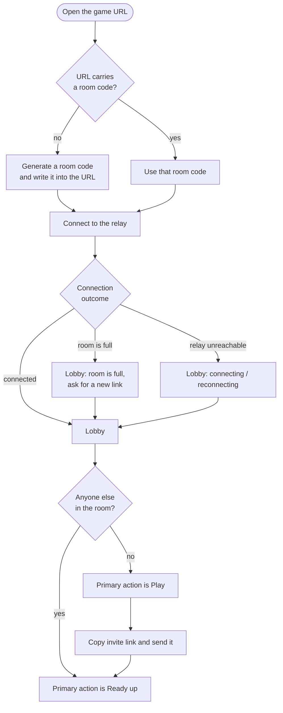
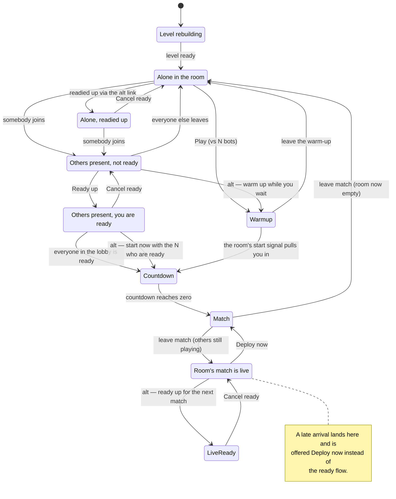
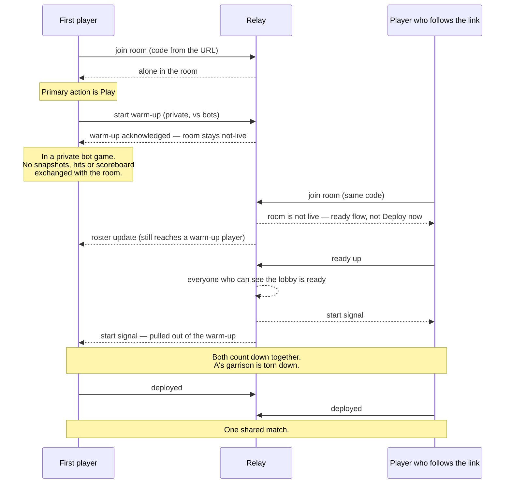
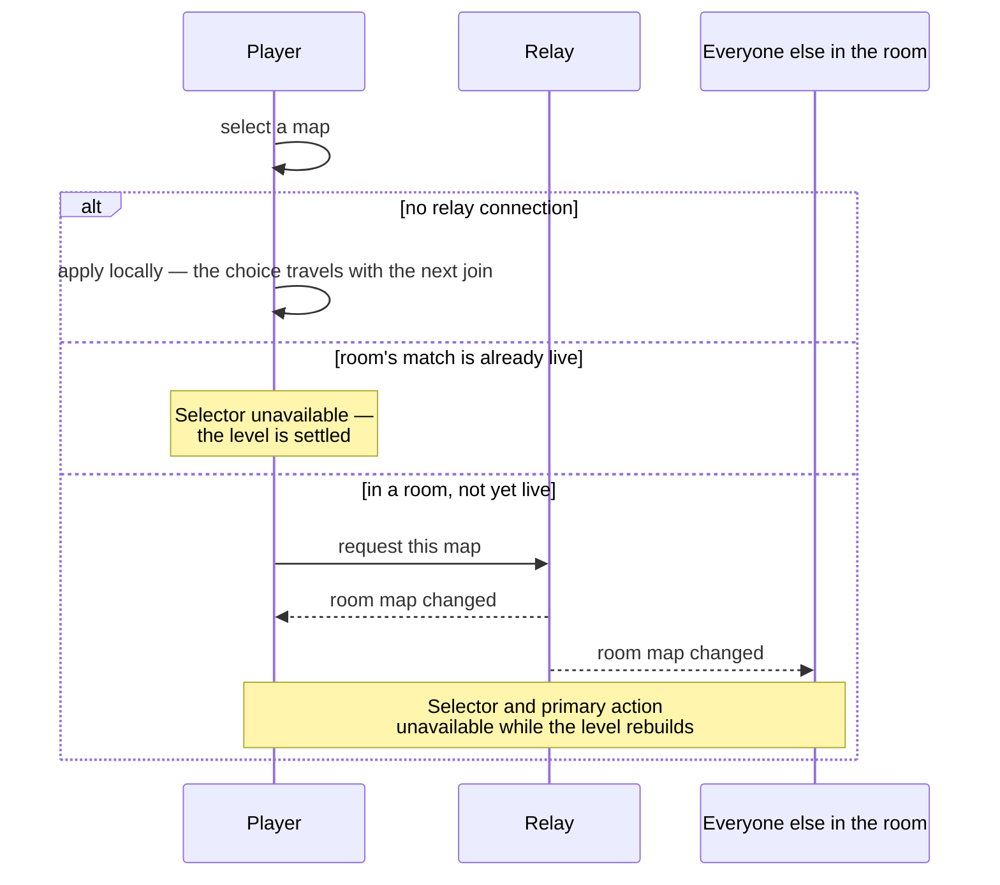
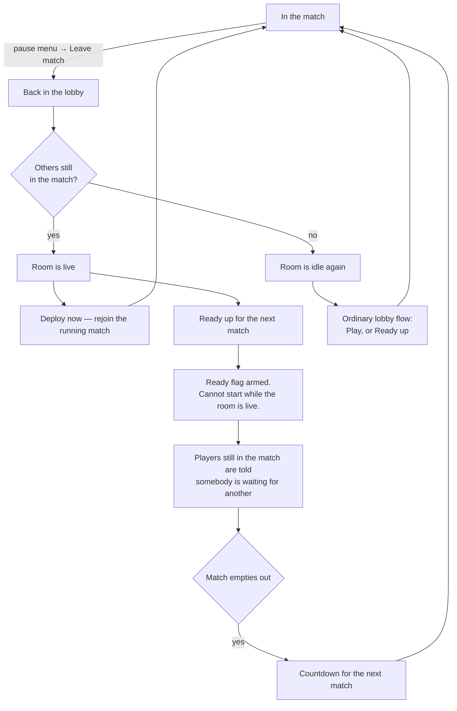

# Flows

How a player gets from opening the URL into a shared match. Companion to
[`screens.md`](./screens.md), which describes what each screen requires and
shows; this file describes the transitions between them.

There is no host. Every load joins a room — if the URL carries no `?room=`, one
is generated and written into the address bar, so **the current URL is always a
valid invite link**. "Hosting" is just being the first player in a room; the
only asymmetry is that whoever arrives first sets the room's map.

---

## 1. Entry — hosting and joining are the same path

The relay is never a gate on playing: a room-full result, a dropped connection
and a first-ever cold load all still reach the lobby with a working primary
action.

---

## 2. The lobby's primary action

One button. Its meaning is whatever the room currently makes it, so getting in
is always a single click.

The ready condition is "everybody **who can see the lobby** has readied up" —
which is not the same as "everybody has readied up". Warm-up players have no
ready flag to give and are excluded from the count; they are pulled into the
countdown instead.

---

## 3. Warm-up vs. the room's match

Pressing **Play** while alone is a warm-up, not a commitment that everyone else
must then join. The relay keeps it private in both directions and does not let
it make the room live.

Without the pull-out, one player pressing Play would lock the room into "match
in progress", and everyone following the invite link would be offered a deploy
into a match whose bots only the first player could see.

---

## 4. Choosing the map

The map is the one lobby choice that is not this client's alone. In a room it
belongs to the room, so a selection is a request the relay answers.

A remote player's choice arrives on the same path as the answer to this
client's own request, so there is one code path and no special case for "my"
change.

---

## 5. Between matches

A match has no scripted end. It runs until people leave it, and the room
survives that — so the invite link never changes.

Arming a rematch never yanks anything out from under the players still in the
firefight — the flag simply cannot start a match while the room is live.
